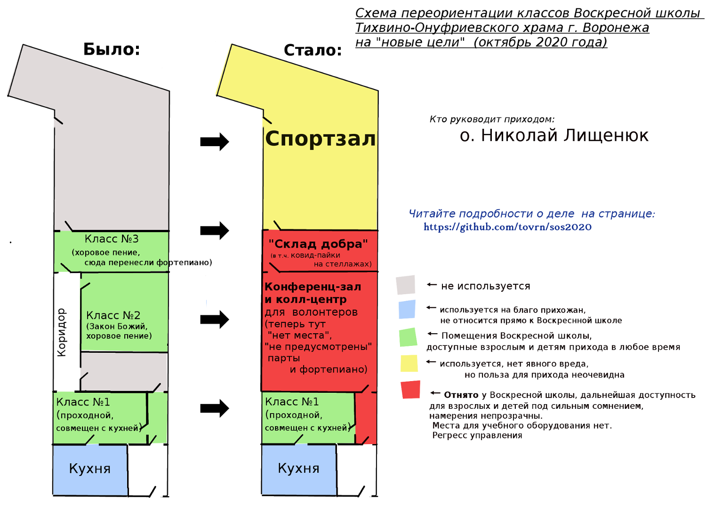
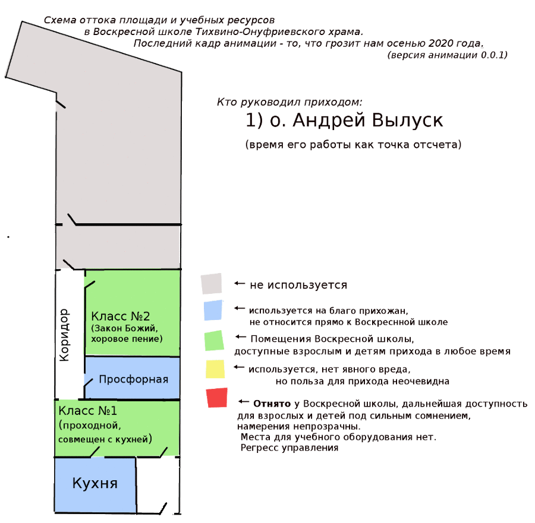
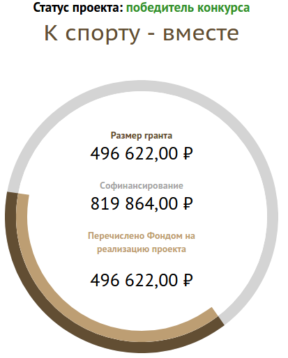
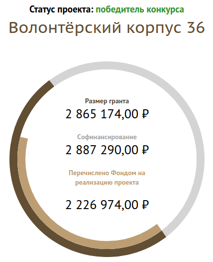
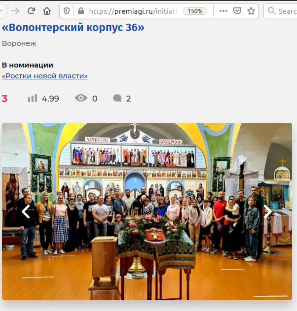
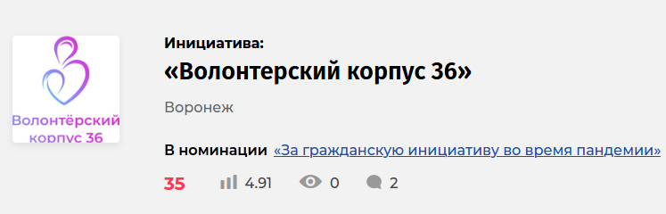
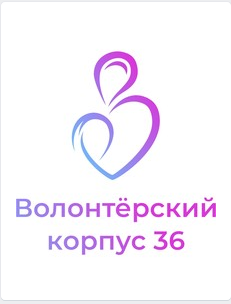
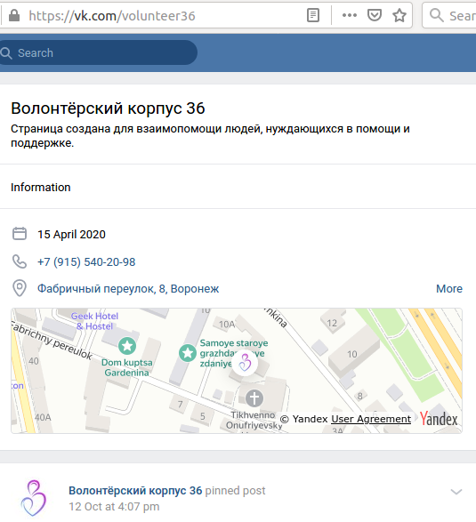
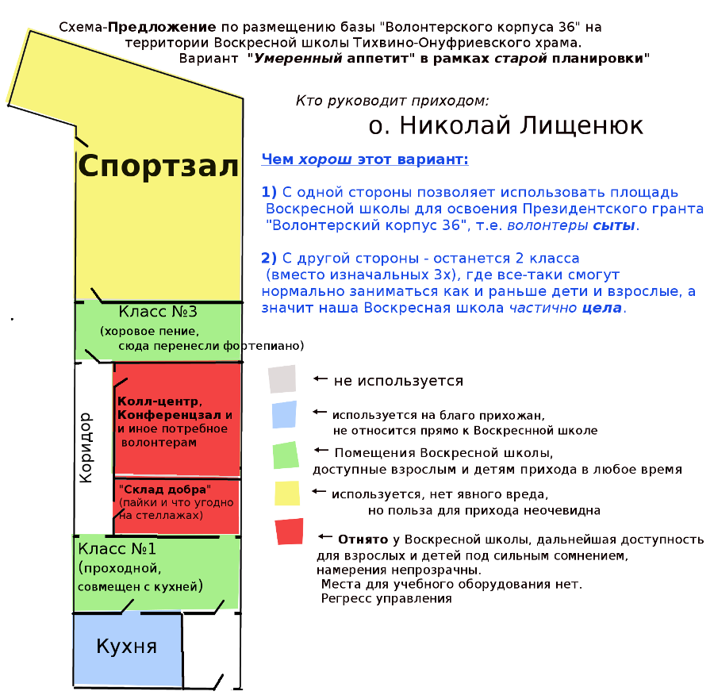

*ВНИМАНИЕ: этот текст периодически обновляется по мере анализа новых сведений. История правок файла как и он сам находится в открытом доступе.*

# 2020: Изъятие помещений Воскресной школы Тихвино-Онуфриевского храма. Информация о ситуации

## Содержание

* [1. Суть проблемы. Деградация условий для прихожан](#main_idea)
* [2. Кому, Как и Зачем отдают помещения Воскресной школы](#who_and_why)
	* [2.1 Грант "К спорту - вместе" и исчерпание неиспользуемых помещений](#grant_1)
	* [2.2 Грант "Волонтерский корпус 36" и поглощение Воскресной школы](#grant_2)
	* [2.3 Организация *"Волонтерский корпус 36"* и характер её деятельности](#vok36)
		* [2.3.1 *"Волонтерский корпус 36"* и "Ростки новой власти"](#vok36_new_auth)
		* [2.3.2 Развоз пайков как сомнительная по эффективности и честности к волонтерам акация. Вопросы руководителям](#paika)
		* [2.3.3 *"Волонтерский корпус 36"*: Православный ли это проект?](#vok36_inside)
* [3. Предлагаемые действия и меры по уменьшению вреда](#possible_solutions)
* [Хронология событий](#history)
* [Используемые источники и литература](#sources_list)

## 1. Суть проблемы. Деградация условий для прихожан  

Из 3 классов доступных для взрослых и детей нашего прихода останется только **одно проходное помещение перед кухней**.
Остальные два класса фактически изымаются из пользования прихода и будут адаптированы 
под нужны организации "Волонтерский корпус 36" (подробнее см. ниже), причем один из классов детской Воскресной школы будет **превращен в склад (!)**.

**Итог**: 

* Детям достается *наименее приспособленное* для занятий детьми и **единственное** из оставляемых в Воскресной школе помещений.
* Взрослые же теперь не смогут заниматься параллельно с детьми/пить чай/есть.

Схема улучшения условий в Воскресной школе "до" и ухудшения после получения грантов о. Николаем:

Анимация той же схемы изменения условия для детей и взрослых прихожан, показано как менялись условия на протяжении времени работы **4х последних настоятелей** :

## 2. Кому, Как и Зачем отдают помещения Воскресной школы 

*Уточним*: до начала последний событиях  **у нас в Воскресной школе было 3 класса**: 

1. первый, более 25 лет доступный всем прихожанам,  проходной класс, смежный с кухней, там была живопись. Там же дети обедали (и сейчас мы обязательно кормим детей, по возможности супом, не только чаем)
2. второй, более 25 лет доступный всем прихожанам , изолированный класс для занятия Законом Божьи, 
там были парты и доска, там же о. Михаил организовал библиотеку (сейчас книги свалены в кучу в следующем помещении, уготованная им судьба не ясна)
3. третий класс, отремонтированный около 10 лет назад о.Михаилов (там до сих пор находится фортепиано).

### 2.1 Грант "К спорту - вместе" и исчерпание неиспользуемых помещений 

С приходом о.Николая стала воплощаться новая тенденция (начатая, но не успевшая как-то оформиться при предыдущем настоятеле о. Александре)
 -- на территории прихода стали запускаться епархиальные проекты (в частности т.н. "Молодежный отдел"), имеющие мало отношения к самим прихожанам, 
эта деятельность в том числе затронула и ресурсы самого прихода, а именно довольно большие по площади помещения Воскресной школы.

Грант финансировался следующим образом (см. значение "Перечислено фондом на реализацию проекта"), почти **500 тысяч рублей**:

*(снимок экрана со страницы заявки на сайте ФПГ 31.10.2020)*

Зал на 31 октября 2020 года ещё не доделан (есть боксерская часть, часть для инвалидов же ещё строится).
В целом полезный проект не принес особой пользы приходу, но что важнее в контексте этой истории - не было и вреда.

*Единственный минус* - куда более крупный следующий грант пришлось уже **съедать вместе с Воскресной школой**, так как другой площади для "Волонтерский корпус 36" на приходе не осталось.

### 2.2 Грант "Волонтерский корпус 36" и поглощение Воскресной школы 

Получение же следующего гранта *(сейчас эти деньги в процессе освоения, ещё не все потеряно, поэтому и написан этот текст)*,
привело вот к какой идее:
1) Из Класса №2 (см. схемы выше, был у Школы с 90-х годов XX века) сделать помещение для условного "Молодежного отдела" 
( в заявке гранта для **"Волонтерского корпуса 36"**, где автор налегает а славный развоз пайков этой структурой), причем изначально говорилось, что 
эта комната будет доступна для детей, но позже *оказалось*, что там не планируют парты
 и туда *нельзя поставить фортепиано*, что автоматически делает комнату *непригодной* для тех занятий, что уже идут или планируются в Воскресной школе.
2) Класс №3 (около 10 лет назад его отремонтировал о.Михаил, поставил там два фортепиано, повесил хрустальные люстры) 
планируется **превратить в стационарный склад** где будут размещены **стеллажи (!)** для хранения правительственных пайков (связано с темой "короновируса").

Подбные преобразования стали возможны за счет солидного вливания денег из Фонда Презеденсткий Грантов, более **2 миллионов рублей**
 одного только прямого гос. финансирования (см. значение "Перечислено"):

*(снимок экрана со страницы заявки на сайте ФПГ 31.10.2020)*

Именно этот проект вызвал острую реакцию части прихожан, организаторов Воскресной школы, занимающихся поддержкой процесса проведения занятий,
 а также родителей учившихся в школе детей.

Решение о передаче помещений школы стало **закономерным итогом**, невнимательности и отсутствия интереса настоятеля к приходу и обычным его людям 

С приходом о. Николая Воскресная школа для детей поддерживалась исключительно усилиями самих прихожан 
(на общественных началах проводились занятия, покупался инвентарь: подрамники, модели предметов для рисования, географические карты, также детям организовывался обед),
 без какой-либо помощи и внимания со стороны настоятеля, 
взрослая же Воскресная школа вообще перестала существовать во время его руководства ещё за пару месяцев до периода "пандемии", так как о.Николай занялся другими делами, после снятия правительственных
ограничений по "самоизоляции" занятия во взрослой школе так и не начались.

Полностью переориентировавшись на *"дела епархиального уровня"*, о.Николай перестал заниматься приходом, получив же грант и вовсе решил оставить Воскресной школе 
только 1 проходной класс, где не смогут одновременно заниматься взрослые и дети, 
и даже просто для детский занятий этот класс *не пригоден*, не говоря уже о том, что даже его площадь будет *уменьшена* (см. схемы выше).

### 2.3 Организация *"Волонтерский корпус 36"* и характер её деятельности 

### 2.3.1 *"Волонтерский корпус 36"*: Ростки новой власти 

Структура *"Волонтерский корпус 36"*, с большей вероятностью является **полуполитической организацией**, о чем прямо говорится в их заявке на получение премии *"Гражданская инициатива 2020"*,
а именно "Корпус" выдвинут в номинации **"Ростки новой власти"**:

*Снимок экрана со страницы номинации (25 октября 2020 г.): [https://premiagi.ru/initiative/5811](https://premiagi.ru/initiative/5811)*

Обновлено: после получения черновика этого доклада, в "Корпусе" осознали, что они выглядят крайне странно, и сменили номинацию
на вариант с более приличным названием:

*Снимок экрана со страницы номинации (31 октября 2020 г.): [https://premiagi.ru/initiative/5811](https://premiagi.ru/initiative/5811)*

Возникает вопрос: разве руководство не видело название номинации до нашего замечания? 

### 2.3.2 Развоз пайков как сомнительная по эффективности и честности к волонтерам акация. Вопросы руководителям 

Склад, в который может превратиться один из классов нашей Воскресной школы (см. схемы и анимацию выше), 
также нужен сейчас именной этой организации для раздачи правительственных пайков.

Один из фактов характера раздачи этих пайков:
Когда одной из наших пожилых прихожанок активно предлагали взять паек, она сказала, что возьмет его из храма домой (проблемы с самостоятельной доставкой не было),
 но ей возразили, что паек волонтеры должны привезти домой сами (хотя они уже были сложены у нас в пощении ВШ
 и совершенно не ясно было **зачем тратить бензин в данном случае?**), после чего эта женщина отказалась, так как процедура показалась ей слишком усложненной.

Согласитесь, что это как минимум странно, разве что, основной целью раздачи была сама раздача, и фотографии процесса.

Вопросы людям, которые вообще-то должны воспитывать нашу молодежь, которая, если и не сразу, то довольно быстро замечает фальшь в любом не совсем внятном деле:

* Рационально ли вообще развозить пайки, тратя значительные ресурсы на доставку? Не проще ли было перевести (правительству) те же деньги на карты пенсионеров?
 Да, **PR-эффект** был бы слабее (если вообще считать, что кто-то считает развоз пайков полезным), но силы волонтеров можно было направить на индивидуальную помощь людям в вопросах, где переводом 700 р. дело не решить (как было с пайками), а не показуху.
* Каков был *реальный процент* пенсионеров (из тех что получали пайки), что по указке правительства заперлись дома и не выходили в магазин несколько месяцев?
* Развозя пайки волонтеры отдавали пенсионерам по факту продукт на те же 700 рублей, но тратили ещё бензин, свое время. 
* Акция была одноразовой (хотя и может повториться, если правительству взбредет в голову опять обрушать экономику под видом борьбы с пандемией) - скольких людей,
по мнению волонтером они *спасли*/*серьезно помогли* конкретно **пайком**, ради склада которых у нас **отнимают учебный класс**?
* Разве не Воскресные школы должны растить настоящих православных волонтеров?
* Разве честно фотографироваться с молодежными отделами других храмов, с людьми, выращенными в **их** школах, при этом способствуя **деградации собственной** Воскресной школы, забросив занятия со взрослыми прихожанами?

### 2.3.3 *"Волонтерский корпус 36"*: Православный ли это проект? 

Трудно сказать воцерковляет ли людей этот проект людей или просто подключает к невнятной деятельности молодежь, которую *уже* 
воспитали родители и  **другие воскресные школы**.
На официальной странице в ВК мы видим вот такой логотип "корпуса":

-- вы заметили тут **христианскую символику**?

Вот так выглядит описание деятельности организации в вк (на момент 24 октября 2020 года):

В числе прочего Волонтерский корпус делает и полезные дела, сопровождая их множеством фотографий в социальных сетях, 
но из этих фотографий почему-то не становится ясно, "позиционируют" (раз уж мы говорим о SMM) ли корпусовцы себя как 
православную организацию или нет.

## 3. Предлагаемые действия и меры по уменьшению вреда  

### 3.1 Меры, которые срочно нужно принять для Тихвино-Онуфриевского прихода

1. Оставить за Воскресной школой Тихвино-Онуфриевского храма **минимум 2 помещения** (раз уж одно из них съедено грантом и на данный момент "снесено"): 
одно для занятий взрослых, второе для детей, а именно:
  * взрослым **оставить (не отнимать)** проходной помещение смежное с кухней
  * детям **оставить светлый класс (не отнимать)** с высоким потолком, отремонтированный о. Михаилом, там где сейчас стоит пианино.
2. Увеличить внимание и заботу о Воскресной школе (сейчас детская поддерживается волонтерскими усилиями нескольких прихожан, взрослая же совсем перестала существовать):
  * **регулярно приглашать детей** на занятия после службы (это должен делать священник, так как он говорит с народом после службы)
  * **возродить занятия для взрослых**, которые проводились при нескольких предыдущих настоятелям, а теперь почему-то прекращены

Иллюстрацию данного предложения относительно использования площади можно посмотреть на схеме ниже:

### 3.2 Как искать и создавать ресурсы (а не отнимать)

Решение есть:
Для межприходских организаций должны быть **межприходские ресурсы**, их интересы (что бы за ними не стояло)
**не должны решаться за счет воскресной школы** в объеме, который серьезно ухудшает условия, для двух групп  (сейчас это одна детская группа и одна взрослая). нужно два класса
и соответствующее оборудование, которое все эти годы уже было в Воскресной школе, а теперь исчезает(!).

* Если нужен склад - **постройте** его, а **не отнимайте** класс у прихода.
* Если нужно что-то масштабное, не совместимое с обычным приходом (у нас обычный приход, и освоение грантов уже вышло из его берегов) -- следует перебраться в центр епархии, 
ведь совсем недалеко от нас есть **Благовещенский собор**, его большой конференц-зал и иные помещения.
Собор находит в более известном месте, что удобно для проведения различных акций, в том числе политического толка.
  

## Используемые источники и литература 

* Страница Инициативной группы прихожан в ВК: https://vk.com/toxvrn
* Неофициальный канал прихожан Тихвино-Онуфриевского храма в Телеграм: https://t.me/tovrn
* Канал настоятеля Тихвино-Онуфриевского храма (о. Николая) в Телеграм (тут можно прочитать про разные достижения): https://t.me/lishenuk
* "Ростки новой власти": https://premiagi.ru/initiative/5811
* Волонтерский корпус 36 в ВК: https://vk.com/volunteer36
* Грант **"К спорту - вместе"** (на чем и закончились свободные помещения): [https://президентскиегранты.рф/public/application/item?id=D0A1CD2C-C494-453A-901C-B76D05FF7DEF](https://президентскиегранты.рф/public/application/item?id=D0A1CD2C-C494-453A-901C-B76D05FF7DEF)
* Грант **"Волонтерский корпус 36"**, вместе с которые начали **съедать** Воскресную школу: [https://президентскиегранты.рф/public/application/item?id=B2A3808F-4710-49DB-8CC6-16CDB6F1EC96](https://президентскиегранты.рф/public/application/item?id=B2A3808F-4710-49DB-8CC6-16CDB6F1EC96)

