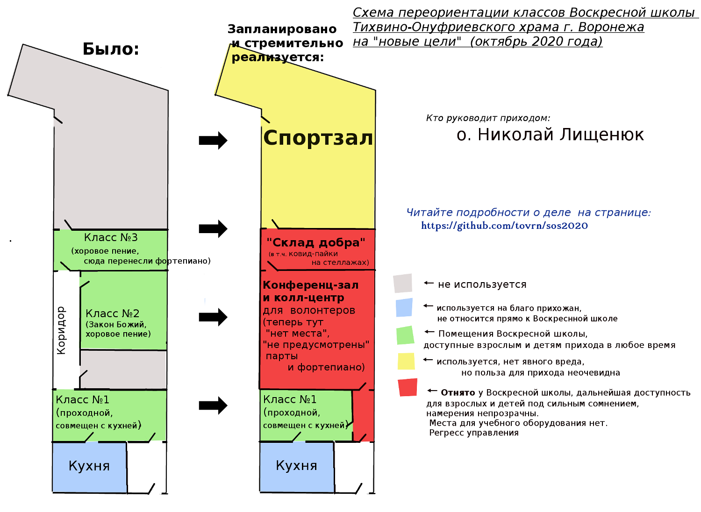

*ВНИМАНИЕ: этот текст периодически обновляется, добавляется новая информация в разделе событий, остальная информация может быть уточнена. История правок файла как и он сам находится в открытом доступе.*


# 2020: Изъятие помещений Воскресной школы Тихвино-Онуфриевского храма. Информация о ситуации


## Содержание

* [1. Суть проблемы. Деградация условий для прихожан](#main_idea)
* [2. Кому, Как и Зачем отдают помещения Воскресной школы](#who_and_why)
	* [2.1 Грант "К спорту - вместе" и исчерпание неиспользуемых помещений](#grant_1)
	* [2.2 Грант "Волонтерский корпус 36" и поглощение Воскресной школы](#grant_2)
	* [2.3 Организация *"Волонтерский корпус 36"* и характер её деятельности](#vok36)
		* [2.3.1 *"Волонтерский корпус 36"* и "Ростки новой власти"](#vok36_new_auth)
		* [2.3.2 Развоз пайков как сомнительная по эффективности и честности к волонтерам акация. Вопросы руководителям](#paika)
		* [2.3.3 *"Волонтерский корпус 36"*: Православный ли это проект?](#vok36_inside)
* [3. Предлагаемые действия и меры по уменьшению вреда](#possible_solutions)
* [Хронология событий](#history)
* [Используемые источники и литература](#sources_list)

## 1. Суть проблемы. Деградация условий для прихожан  <a name="main_idea"></a>

Из 3 классов доступных доступных до последнего времени для взрослых и детей Воскресной школы **останется только один класс**.
Остальные два класса фактически изымаются из пользования прихода и будут адаптированы 
под нужны т.н. "волонтеров" (подробнее см. ниже), причем один из классов детской Воскресной школы будет **превращен в склад (!)**.

**Итог**: 

* Детям достается *наименне приспособленное* для занятий детьми и **единственное** из оставляемых в Воскресной школе помещений, плохо подходящее для занятий (из-за смежности с кухней).
* Взрослые же теперь не смогут заниматься параллельно с детьми и пить чай (или делать более основательную трапезу).
Именно забрасывание  о.Николаем ещё до "пандемии" занятий во взрослой Воскресной школе
сделало возможной мысль о "всего-то трех детях" (взрослых больше!), 
которых можно запихнуть куда угодно и позволило так капитально перекроить площадь классов на деньги Фонда президенскиг грантов (подробности ниже).

Схема улучешения условий в Воскресной школе "до" и ухудшения после получения грантов о. Николаем:



Анимация той же схемы измения условия для детей и взрослых прихожан, показано как менялись условия на протяжении времени работы **4х последних настоятелей** <a name="main_animation"></a>:


## 2. Кому, Как и Зачем отдают помещения Воскресной школы <a name="who_and_why"></a>

*Уточним*: до начала последний событиях  **у нас в Воскресной школе было 3 класса**: 

1. первый, более 25 лет доступный всем прихожанам,  проходной класс, смежный с кухней, там была живопись. Там же дети обедали (и сейчас мы обязательно кормим детей, по возможности супом, не только чаем)
2. второй, более 25 лет доступный всем прихожанам , изолированный класс для занятия Законом Божьи, 
там были парты и доска, там же о. Михаил организовал библиотеку (сейчас книги свалены в кучу в следующем помещении, уготованная им судьба не ясна)
3. третий класс, отремонтированный около 10 лет назад о.Михаилов (там до сих пор находится фортепиано).

### 2.1 Грант "К спорту - вместе" и исчерпание неиспользуемых помещений <a name="grant_1"></a>

С приходом о.Николая стала воплощаться новая тенденция (начатая, но не успевшая как-то оформиться при предыдущем настоятеле о. Александре)
 -- на территории прихода стали запускаться епархиальные проекты (в частности т.н. "Молодежный отдел"), имеющие мало отношения к самим прихожанам, 
эта деятельность в том числе затронула и ресурсы самого прихода, а именно довольно большие по площади помещения Воскресной школы.

Грант финансировался следующим образом (см. значение "Перечислено фондом на реализацию проекта"), почти **500 тысяч рублей**:


*(скимок экрана со страницы заявки на сайте ФПГ 31.10.2020)*

Зал на 31 октября 2020 года ещё не доделан (есть боксерская часть, часть для инвалидов же ещё строится).
В целом полезный проект не принес особой пользы приходу, но что важнее в котексте этой истории - не было и вреда.

*Единственный минус* - куда более крупный следующий грант пришлось уже **съедать вместе с Воскресной школой**, так как другой площади для "Волонтерский корпус 36" на приходе не осталось.

### 2.2 Грант "Волонтерский корпус 36" и поглощение Воскресной школы <a name="grant_2"></a>

Получение же следующего гранта *(сейчас эти деньги в процессе освоения, ещё не все потеряно, поэтому и написан этот текст)*,
привело вот к какой идее:
1) Из Класса №2 (см. схемы выше, был у Школы с 90-х годов XX века) сделать помещение для условного "Молодежного отдела" 
( в заявке гранта для **"Волонтерского корпуса 36"**, где автор налегает а славный развоз пайков этой структурой), причем изначально говорилось, что 
эта комната будет доступна для детей, но позже *оказалось*, что там не планируют парты
 и туда *нельзя поставить фортепиано*, что автоматически делает комнату *непригодной* для тех занятий, что уже идут или планируются в Воскресной школе.
2) Класс №3 (около 10 лет назад его отремонтировал о.Михаил, поставил там два фортепиано, повесил хрустальные люстры) 
планируется **превратить в стационарный склад** где будут размещены **стеллажи (!)** для хранения правительственных пайков (связано с темой "короновируса").

Праздник волонтерства стал возможен за счет солидного вливания денег из Фонда Президенский Грантов, более **2 миллионов рублей**
 одного только прямого гос. финансирования (см. значение "Перечислено"):


*(скимок экрана со страницы заявки на сайте ФПГ 31.10.2020)*


Имено этот проект вызвал острую реакцию части прихожан, организаторов Воскресной школы, занимающихся поддержкой процесса проведения занятий,
 а также родителей учившихся в школе детей.


### 2.3 Организация *"Волонтерский корпус 36"* и характер её деятельности <a name="vok36"></a>


### 2.3.1 *"Волонтерский корпус 36"*: Ростки новой власти <a name="vok36_new_auth"></a>

Структура *"Волонтерский корпус 36"*, с большей вероятностью является **полуполитической организацией**, о чем прямо говорится в их заявке на получение премии *"Гражданская инициатива 2020"*,
а именно "Корпус" выдвинут в номинации **"Ростки новой власти"**:


*Снимок экрана со страницы номинации (25 октября 2020 г.): [https://premiagi.ru/initiative/5811](https://premiagi.ru/initiative/5811)*

Обновлено: после получения черновка этого доклада, в "Корпусе" осознали, что они выглядят крайне странно, и сменили номинацию
на вариант с более приличным названием:


*Снимок экрана со страницы номинации (31 октября 2020 г.): [https://premiagi.ru/initiative/5811](https://premiagi.ru/initiative/5811)*

Возникает вопрос: разве руководство не видело название номинации до нашего замечания? 


### 2.3.2 Развоз пайков как сомнительная по эффективности и честности к волонтерам акация. Вопросы руководителям <a name="paika"></a>

Склад, в который может превратиться один из классов нашей Воскресной школы (см. схемы и анимацию выше), 
также нужен сейчас именной этой организации для раздачи правительственных пайков.

Один из фактов характера раздачи этих пайков:
Когда одной из наших пожилых прихожанок активно предлагали взять паек, она сказала, что возьмет его из храма домой (проблемы с самостоятельной доставкой не было),
 но ей возразили, что паек волонтеры должны привезти домой сами (хотя они уже были сложены у нас в пощении ВШ
 и совершенно не ясно было **зачем тратить бензин в данном случае?**), после чего эта женщина отказалась, так как процедура показалась ей слишком усложненной.

Согласитесь, что это как минимум странно, разве что, основной целью раздачи была сама раздача, и фотографии процесса.

Вопросы людям, которые вообще-то должны воспитывать нашу молодеж, которая, если и не сразу, то довольно быстро замечает фальш в любом не совсем внятном деле:

* Рационально ли вообще развозить пайки, тратя значительные ресурсы на доставку? Не проще ли было перевести (правительству) те же деньги на карты пенсионеров?
 Да, **PR-эффект** был бы слабее (если вообще считать, что кто-то считает развоз пайков полезным), но силы волонтеров можно было направить на индивидуальную помощь людям в вопросах, где переводом 700 р. дело не решить (как было с пайками), а не показуху.
* Каков был *реальный процент* пенсионеров (из тех что получали пайки), что по указке правительства заперлись дома и не выходили в магазин несколько месяцев?
* Развозя пайки волонтеры отдавали пенсионерам по факту продукт на те же 700 рублей, но тратили ещё бензин, свое время. 
* Акция была одноразовой (хотя и может повториться, если правительству взбредет в голову опять обрушать экономику под видом борьбы с пандемией) - скольких людей,
по мнению волонтером они *спасли*/*серьезно помогли* конкретно **пайком**, ради склада которых у нас **отнимают учебный класс**?
* Разве не Воскресные школы должны растить подобных волонтеров?
* Разве честно фотографироваться с молодежными отделами других храмов, с людьми, выращенными в **их** школах, при этом способствуя **деградации собственной** Воскресной школы, заброси занятия со взрослыми прихожанами?

### 2.3.3 *"Волонтерский корпус 36"*: Православный ли это проект? <a name="vok36_inside"></a>

Трудно сказать воцерковляет ли людей этот проект людей или просто подключает к невнятной деятельности молодежь, которую *уже* 
воспитали родители и  **другие воскресные школы**.
На официальной странице в ВК мы видим вот такой логотип "корпуса":


-- вы заметили тут **христианскую символику**?

Вот так выглядит описание деятельности организации в вк (на момент 24 октября 2020 года):


В числе прочего Волонтерский корпус делает и полезные дела, сопровождая их множеством фотографий в социальных сетях, 
но из этих фотографий почему-то не становится ясно, "позиционируют" (раз уж мы говорим о SMM) ли корпусовцы себя как 
православную организацию или нет.


## 3. Предлагаемые действия и меры по уменьшению вреда  <a name="possible_solutions"></a>


### 3.1 Меры, которые срочно нужно принять для Тихвино-Онуфриевского прихода

1. Оставить за Воскресной школой Тихвино-Онуфриевского храма **минимум 2 помещения** (раз уж одно из них съедено грантом и на данный момент "снесено"): 
одно для занятий взрослых, второе для детей, а именно:
  * взрослым **оставить (не отнимать)** проходной помещение смежное с кухней
  * детям **оставить светлый класс (не отнимать)** с высоким потолком, отремонтированный о. Михаилом, там где сейчас стоит пианино.
2. Увеличить внимание и заботу о Воскресной школе (сейчас детская поддерживается волонтерскими усилиями нескольких прихожан, взрослая же совсем перестала существовать):
  * **регулярно приглашать детей** на занятия после службы (это должен делать священник, так как он говорит с народом после службы)
  * **возродить занятия для взрослых**, которые проводились при нескольких предыдущих настоятелям, а теперь почему-то прекращены

Иллюстрацию данного предложения относитительно использования площади можно посмотреть на схеме ниже:


### 3.2 Как искать и создавать ресурсы (а не отнимать)

Решение есть:
Для межприходских организаций должны быть **межприходские ресурсы**, их интересы (что бы за ними не стояло)
**не должны решаться за счет воскресной школы** в объеме, который серьезно ухудшает условия, для двух групп  (сейчас это одна детская группа и одна взрослая). нужно два класса
и соответствующее оборудование, которое все эти годы уже было в Воскресной школе, а теперь исчезает(!).


* Если нужен склад - **постройте** его, а **не отнимайте** класс у прихода.
* Если нужно что-то масштабное, не совместимое с обычным приходом (у нас обычный приход, и освоение грантов уже вышло из его берегов) -- следует перебраться в центр епархии, 
ведь совсем недалеко от нас есть **Благовещенский собор**, его большой конференц-зал и иные помещения.
Собор находит в более известном месте, что удобно для проведения различных акций, в том числе политического толка.
  

## Хронология событий <a name="history"></a>


### 4 октября 2020

4 октября 2020 стало известно, что о. Николай планирует *кардинально сократить* площадь помещений Воскресной школы Тихвино-Онуфриевского храма
 (в пользу т.н. "Волонтерского корпуса 36" и иной деятельности не связанной прямо с приходом) и фактически резко ухудшить условия это обычных прихожан и детей.
 Эти условия для занятий создавались предыдущими настоятелями на протяжении последних более чем *25 лет* и менялись ранее только в лучшую сторону.

 Стало известно, что ремонтируемые в рамках президенского гранта помещения:

* или служат *не для размещения людей* (как "Склад добра" вместо класса музыки для Воскресной школы)
* или имеют планировку/оборудование/режим эксплуатация, *не ориентированную на занятия и свободный доступ для занятий*.
 При этом ориентированную на слеты волотеров, офис/колл-центр, на что пошло помещение, где 
последние два года (и много лет до этого) дети занимались по предмету "Закон Божий" 
Факт **утраты функционала** следует и из слова настоятеля (он сказал, что парты и фортепиано разместить в новом помещнии невозможно), 
так и из заявки на грант, см. раздел [2.2 Грант "Волонтерский корпус 36" и поглощение Воскресной школы](#grant_2).

### 11 октября 2020

 1. 11 октября 2020 года о. Николай в ответ на недовольство родителей написал, что распорядится *убрать все объявления* о внутреннем интернет-чате прихода с территории храма (что и сделал),
что не дает более привлекать туда новых людей, а значит и рассказать о происходящем (так как далеко не все прихожане сейчас пользуются этой интернет-системой). 
Остается только публикация и/или раздача этого текста в печатном виде. 
 2. Начато составление текста этого доклада, через пару дней опубликована первая версия его черновика.

### 25 октября 2020

25 октября 2020 года, после Литургии в первом классе (том единственным, что перегородят коридором, но все-таки оставят) Воскресной школы состоялась
первая встреча инициативной группы прихожан из 8 человек (все они ходят в наш храм более 10 лет, кто-то более 25 лет) с о.Николаем и одним из его волонтеров (ходит к нам около полугода).

На этой встрече о.Николай: 

1. подтвердил все негативные планы по Воскресной школе, 
указывая на то, что это рациональное решение, и что дети (*"всего-то три человека!"*) смогут заниматься
 и в перегороженном стенкой планируемого дополнительного коридора классе (про то, что взрослым тоже нужно место для занятий почему-то умалчивалось).
2. объявил о смене преподавательского состава (`"у детей будут вести занятия или я или о.Александр"` - цитата). 
Предыдущий преподаватель, отстранен от процесса (видимо, потому что слишком возмушается распилом Школы на новые нужды новых людей).

#### 25 октября 2020: Попытка "дать отвод" паре участников встречи

Примечательно, что о.Николай попытался "дать отвод" двум участникам встречи *(их имена известны остальным собравшимся и в т.ч. автору текста доклада)*:

* `Диалог №1` (цитирование неточное, максимально близко по смыслу):

```
 – У вас что, сюда дети ходят?! –  спросил о.Николай у женщины.
 – Сын ходил много лет... – ответила прихожанка.
 – А сейчас ходит? – c понятной целью продолжил спрашивать 
руководитель "Волонтерского корпуса 36".

Тут женщина оказалась в замешательстве, не зная что ответить, 
и как вообще объяснить свое право интересоваться судьбой Воскресной школы.

 – Внуки ходить будут! – подсказали другие прихожане. 
На чем вопросы к женщине закончились.
```

* `Диалог №2` (цитирование неточное, максимально близко по смыслу):

```
 – Что-то я вас не видел ни разу на уборке храма! – сказал о.Николай ещё одной участнице собрания.
 – Да, меня там на было, но, все же, я тоже вношу свою лепту.. – ответила вторая женщина.
 – Как?
 – Деньгами.

После чего обсуждение, опять же, вернулось к теме встречи ("Почему это происходит с воскресной школой?").
```

## Используемые источники и литература <a name="sources_list"></a>

* Страница Инициативной группы прихожан в ВК: https://vk.com/toxvrn
* Неофициальный канал прихожан Тихвино-Онуфриевского храма в Телеграм: https://t.me/tovrn
* Канал настоятеля Тихвино-Онуфриевского храма (о. Николая) в Телеграм (тут можно прочитать про разные достижения): https://t.me/lishenuk
* "Ростки новой власти": https://premiagi.ru/initiative/5811
* Волонтерский корпус 36 в ВК: https://vk.com/volunteer36
* Грант **"К спорту - вместе"** (на чем и закончились свободные помещения): [https://президентскиегранты.рф/public/application/item?id=D0A1CD2C-C494-453A-901C-B76D05FF7DEF](https://президентскиегранты.рф/public/application/item?id=D0A1CD2C-C494-453A-901C-B76D05FF7DEF)
* Грант **"Волонтерский корпус 36"**, вместе с которые начали **съедать** Воскресную школу: [https://президентскиегранты.рф/public/application/item?id=B2A3808F-4710-49DB-8CC6-16CDB6F1EC96](https://президентскиегранты.рф/public/application/item?id=B2A3808F-4710-49DB-8CC6-16CDB6F1EC96)


