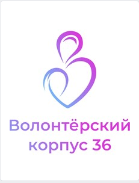

8 ноября 2020 года состоялось Приходское собрание Тихвино-Онуфриевского храма.

На собрание пустили не только "официальных" участников этого Приходского Собрания, но и всех желающих поучаствовать прихожан (о несогласии Инициативной группы с недопуском всех пришедших было известно заранее,
 [текст отдельного сообщения](2020-11-08-sobranie-1-poz.md) был отправлен в т.ч. и о. Андрею Скакалину).
Кроме нашего настоятеля о. Николая Лищенюка были наш благочинный о. Геннадий Пашкевич  и секретарь епархиального управления о. Андрей Скакалин. 
Со стороны нашей Инициативной группы были зачитаны следующие вопросы:

# Вопросы требующие срочного обсуждения: о. Андрею Скакалину, о. Николаю Лищенюку, официальному "Приходскому собранию" (не представляющему всех прихожан) и остальным прихожанам  на встрече "Приходского Собрания" Тихвино-Онуфриевского храма г. Воронежа  8 ноября 2020 года.

## 1) Воскресная школа - остановка работы без должной мотивировки:

### 1.1) Почему уже три недели как **закрыта** детская Воскресная школа, в то время как Воскресные школы других храмов продолжают работать? (используется предлог "пандемии")

**Что отвечали:**
*Со слов о. Николая Лищенюка:* Детская Воскресная **будет открыта**, там будет и рисование и пение, 
новые "профессиональные" педагоги, вместо старого "непрофессионального".

При этом *так и не было сказано*, не смотря на несколько раз заданных вопросов по темам:

  * почему вообще Воскресная школа была  отправлена "на карантин" как раз тогда,
 когда стало известно, что не всем прихожанам понравилась идея размещения стеллажей склада на территории школы, 
а также другие идеи вредной перепланировки здания),
тогда как в других воскресных школах занятия продолжались.
  * **когда именно** начнутся занятия

### 1.2)  Почему **не возобновлены** занятия во взрослой Воскресной школе по воскресеньям после службы?

**Что отвечали:**
*Со слов о. Николая Лищенюка:* Занятия во взрослой Воскресной школе **будут возобновлены**
 (*когда именно, опять же, не уточнялось*), о.Николай также сказал, что (неточная цитата): 
*"если есть такая потребность - будем проводить занятия по воскресеньям после Службы"*.

*Примечание:* такая **потребность есть** (см. наше открытое письмо митрополиту Воронежскому и Лискинскому Сергию).

Тут же о. Андрей Скакалин начал объяснять прихожанам, что  (неточная цитата):
*"У вас не детская Воскресная школа, а воскресная группа,
 т.к. именно это сказано на сайте епархии, а взрослой Воскресной школы у вас тут вроде и не было,
т.к. на сайте епархии о ней ничего не сказано..."*.

Эти слова позволили автору данного текста найти и озвучить ответ на ранее заданный на этом собрании о.Андреем вопрос (неточная цитата):
 *"Зачем открытое письмо опубликовали в Интернете?"*
Ответ был такой: *"Чтобы все точно знали, что это письмо и люди под ним подписавшиеся **существуют**, а то выйдет как с нашей Воскресной школой - нет на сайте, значит и вообще нет, а то, чего нет, и сохранять не надо."*

### 1.3) Почему проводится попытка забрать последний нормальный класс Воскресной школы под склад? Объяснение о. Николая "если надо, то и мой дом будет складом" - не серьезно, т.к. прежде всего складом должен стать здоровенный спортзал, который в отличие от Воскресной школы получает внимание настоятеля и продолжает работать.

**Что отвечали:**
Все три помещения (Класс №1, Класс №3 и то что получилось на месте снесенного Класса №2) 
будут доступны детям и взрослым, "Волонтерский корпус 36" не будет им мешать, т.к. будет использовать
помещения Воскресной школы (в публикациях корпус 36 называет эти помещения "своим штабом") **"по будним дням"**.

*Со слов о. Николая Лищенюка:* 
Занятия со взрослыми по воскресеньям будут проходить именно на площади ранее снесенного Класса №2.

*Примечание:*
**Интрига** расположения уже ставшего знаменитым т.н. "Склада добра" 
(который чуть было не занял своими стеллажами место Класса №3 нашей Школы)
 до сих пор сохраняется, четких слов о положении этого объекта в пространстве произнесено не было 
(как и в случае с датой выхода Школы "с карантина")
 хотя и есть *косвенные признаки ослабления угрозы*. Будем следить за ситуацией.

### 1.4) Аргументы о. Николая  _"о трех детях в Воскресной школе"_  или о том, что _"...у меня в алтаре и боксерской секции детей больше, чем у вас в Воскресной школе"_ - о чем они говорят? Настоятель не заинтересован в Воскресной школе. Вот что по этому поводу говорит о своей школе директор Воскресной школы Адмиралтейского храма: _«Этих детей  не я привожу за руку сюда — это работа и заслуга нашего настоятеля, который ведёт Воскресную школу для взрослых. И эти взрослые — родители — приводят своих детей к нам в храм и Воскресную школу.»_ У нас же нет взрослой Школы, а потому и детская Школа малочисленна.

**Что отвечали:**
Детская Воскресная школа будет лучше прежней, теперь настоятель займется и ей тоже.

## 2) Освоение гранта, странности управления и потенциальная угроза конструкции здания Воскресной школы:

* **2.1) Вопрос:** Почему освоение гранта начинают со сноса стен и бездумного прорубания новых дверных отверстий в стенах несущих? Кто давал экспертные оценки того, что подобная перепланировка допустима в принципе? Как скажется эта перестройка на здании в будущем? Голосовало ли за это Приходское Собрание?
* **2.2) Вопрос:**  Почему на ремонт вообще расходуются такие значительные средства? Как крепкие деревянные полы и стены Класса №2 помешали непосредственной деятельности волонтеров - помощи людям? Почему помещение потеряло функциональность как класс Воскресной школы? Голосовало ли за это Приходское собрание? Утверждались ли сметы?

## 3) "Волонтерский корпус 36" - в чем состоит его "заслуга", и чего стесняется руководство корпуса:

* **3.1) Вопрос:** **Название** _«Волонтерский корпус 36»_ - почему там нет слов о Православии, Христианстве или связанных сущностях?
* **3.2) Вопрос:** **Логотип**  «Волонтерского корпуса 36» - почему там нет вообще никакой христианских символов? Чего тут стесняются? Или так проще получить грант?

* 3.3) Пайки как **неубедительная реклама** действий правительства:  Улучшение имиджа власти средствами ничего не решающего для простых людей разового «развоза пайков».
  Волонтеры куда рациональнее потратили бы свое время и личные средства, если стоимость пайков была бы просто переведена на карты пенсионеров.  

В Москве волонтерила и пиарилась с этими пайками Ксения Собчак и другие медийные персоны, а у нас -- молодежный отдел РПЦ.

Именно отсутствие нормальных действий правительства должно было быть __припудрено__ развозом пайков организацией под безликим названием "Волонтерский корпус 36" с абсолютно **стерильным** логотипом.
